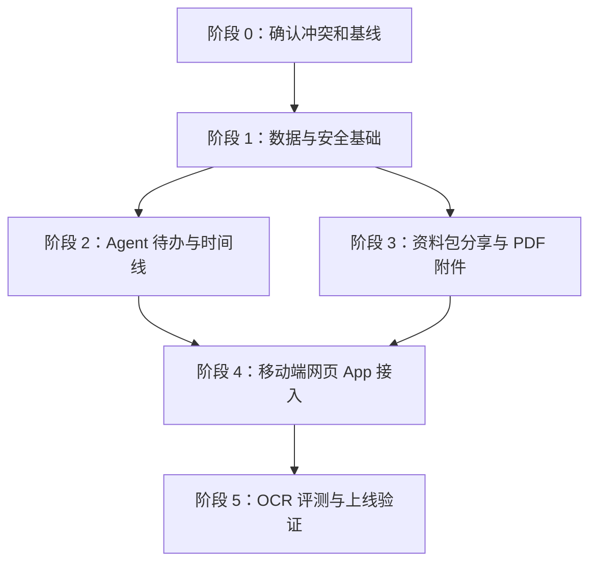

# 医记 Agent 版本实施计划

本文基于 `SPEC.md`、`docs/TECHNICAL_DESIGN.md`、`tasks/plan.md`、`tasks/todo.md` 汇总形成，是后续开发执行的总控计划。当前文档只描述任务、依赖、完成条件和验证方法，不代表已经开始编码。

## 1. 实施原则

医记第一版 Agent 不做聊天窗口。Agent 能力嵌入现有网页 App 流程中，主要负责资料整理、字段核对提醒、时间线生成、复诊前资料包准备和待办提醒。

所有实现必须遵守以下边界：

- 不提供诊断建议。
- 不提供治疗建议。
- 不提供用药建议。
- 不替代医生判断。
- 第一版只支持同一账号内管理本人和家庭成员档案。
- 第一版后端禁用跨账号邀请、授权和协作接口。
- 原始资料生产环境统一存储到阿里云 OSS。
- 错误监控使用阿里云日志服务。
- 数据库每天自动备份一次，保留 30 天，严重故障目标 24 小时内恢复。

## 2. 阶段与依赖关系



## 3. 阶段 0：确认冲突和基线

任务：确认 SPEC 与现有代码的冲突处理方式，并把关键产品和工程决策写入文档。

依赖关系：无。

输入：

- `SPEC.md`
- 当前 Prisma schema
- 当前后端控制器
- 当前 `app.html`

输出：

- 已确认的开发边界
- 已更新的技术方案和任务清单

完成条件：

- 跨账号家庭授权已确认后端禁用。
- 错误监控已确认使用阿里云日志服务。
- 备份策略已确认每天一次、保留 30 天、严重故障目标 24 小时内恢复。

阶段验证方法：

- 人工检查 `SPEC.md`、`docs/TECHNICAL_DESIGN.md`、`tasks/plan.md`、`tasks/todo.md`。
- 不运行代码。

当前状态：已完成。

## 4. 阶段 1：数据与安全基础

任务：先补齐资料包分享、Agent 元数据、OSS 健康检查和权限边界。该阶段是后续 Agent、资料包、分享链接和上线验证的基础。

依赖关系：

- 阶段 0 已完成。
- 分享链接依赖 `VisitPack`。
- Agent metadata 依赖 `TodoItem`、`MedicalRecord`、`RecognitionTask`。
- OSS 健康检查依赖 `RecordFileStorageService`。

输入：

- `prisma/schema.prisma`
- `apps/api/src/visit-packs/*`
- `apps/api/src/todos/*`
- `apps/api/src/records/record-file-storage.service.ts`
- 现有鉴权和审计服务

输出：

- 资料包分享数据模型。
- 分享 token 生成和 hash 规则。
- Agent metadata 结构。
- OSS 配置和健康检查方案。
- 后端禁用跨账号邀请/授权能力的实现方案。

完成条件：

- 分享链接只保存 token hash，不在数据库保存明文 token。
- 分享链接支持有效期、撤回、访问次数和最后访问时间。
- 新增接口有明确鉴权或公开访问边界。
- 跨账号邀请/授权接口不可被外部正常调用。
- OSS 配置缺失时能在健康检查中明确暴露。

阶段验证方法：

```bash
npm run prisma:validate
npm run build
npm test
```

人工验证：

- 调用跨账号邀请/授权接口应返回禁用状态。
- OSS 健康检查能区分配置缺失和配置可用。

## 5. 阶段 2：Agent 待办与时间线

任务：实现第一版 Agent 的核心能力。Agent 不通过聊天窗口出现，而是在病历资料、时间线、待办和资料包流程中主动生成整理建议。

依赖关系：

- 依赖阶段 1 的 Agent metadata。
- 时间线依赖已归档病历资料。
- 待办规则依赖病历字段完整度、复诊日期和资料包状态。

输入：

- 已归档病历资料
- OCR 识别字段
- 用户确认字段
- 复诊日期
- 资料包状态

输出：

- Agent 规则服务。
- 资料补全待办。
- 复诊提醒待办。
- 上传报告待办。
- 生成资料包待办。
- 服务端时间线接口。

完成条件：

- 上传后未核对字段会生成资料补全待办。
- 复诊临近时会生成资料包准备提醒。
- 时间线按成员隔离，按时间从新到旧排序。
- 时间线支持全部和分类查看。
- Agent 文案不包含诊断、治疗、用药建议。

阶段验证方法：

```bash
npm run build
npm test
```

人工验证：

- 上传一份缺少日期的资料，应出现“补全资料”类待办。
- 设置复诊日期后，应出现复诊前资料包提醒。
- 病历资料保存后，应自动出现在时间线中。

## 6. 阶段 3：资料包分享与 PDF 附件

任务：补齐资料包真实就诊使用能力，包括限时分享链接、撤回访问、PDF 导出和原始资料嵌入。

依赖关系：

- 依赖阶段 1 的分享数据模型。
- PDF 附件依赖 OSS 文件读取能力。
- 分享预览依赖资料包生成结果。

输入：

- `VisitPack`
- `MedicalRecord`
- `MedicalRecordFile`
- OSS 私有文件

输出：

- 创建分享链接接口。
- 撤回分享链接接口。
- 公开分享访问接口。
- 资料包 PDF 附件模式。
- 原始图片资料嵌入 PDF。
- PDF 原件处理策略。

完成条件：

- 用户可以生成资料包分享链接。
- 分享链接支持过期和撤回。
- 撤回或过期后不能访问资料包。
- 分享访问不需要登录，但只能访问指定资料包。
- 用户选择附原件时，原始资料应嵌入 PDF 或给出明确可理解的处理说明。
- 分享访问写入审计日志。

阶段验证方法：

```bash
npm run build
npm test
```

人工验证：

- 创建分享链接后可打开资料包预览。
- 撤回后再次访问失败。
- 导出的 PDF 包含本次就诊目的、近期情况、就医时间线、关键资料清单、想问医生的问题和附件内容。

## 7. 阶段 4：移动端网页 App 接入

任务：把后端能力接入当前移动端网页 App，保持页面更像 App，而不是后台管理系统。

依赖关系：

- Agent 待办依赖阶段 2。
- 时间线接口依赖阶段 2。
- 资料包分享和 PDF 附件依赖阶段 3。

输入：

- Agent 待办接口
- 时间线接口
- 资料包分享接口
- PDF 导出接口
- 当前 `app.html`

输出：

- 病历页展示按时间排列的病历资料。
- 病历页支持查看原件、编辑字段、加入资料包、重新识别、删除。
- 待办页展示 Agent 生成的就医相关任务。
- 资料包页支持选择附件、生成 PDF 和分享链接。
- 个人中心保留隐私、安全、导出、删除、成员切换等必要入口。

完成条件：

- 底部导航保持病历、待办、个人中心。
- 页面文案通俗，不出现技术化提示。
- 主按钮单一明确。
- 手机宽度下核心流程可完成。
- 不出现原型案例数据。
- 不出现诊断、治疗、用药建议。

阶段验证方法：

- 浏览器手机宽度手工验证。
- 上传、核对、归档、时间线、待办、资料包、导出、分享全流程验收。

建议命令：

```bash
npm run build
npm test
```

## 8. 阶段 5：OCR 评测与上线验证

任务：用真实资料验证 OCR 准确率和流程稳定性，并完成上线前工程检查。

依赖关系：

- OCR 评测依赖资料上传、识别、核对、归档流程稳定。
- 上线验证依赖 OSS、HTTPS、备份、监控和健康检查。

输入：

- 用户提供 30-50 份真实资料。
- 每份资料的人工标准答案。
- OCR 测试记录页面。
- 阿里云 ECS 运行环境。
- 阿里云 OSS。
- 阿里云日志服务。

输出：

- OCR 测试记录。
- 字段准确率报告。
- 人工修改率报告。
- 流程成功率报告。
- 上线前检查记录。

完成条件：

- 完成第一轮 30-50 份资料测试。
- 记录上传成功率、可读识别率、关键字段准确率、人工修改率、流程成功率。
- 明确是否继续使用百度 OCR，还是升级医疗 OCR 或高精度 OCR。
- OSS 上传、读取、删除验证通过。
- 阿里云日志服务能看到关键错误日志。
- 备份脚本能生成备份文件。
- 上线前至少完成一次恢复演练。

阶段验证方法：

```bash
npm run check
curl http://127.0.0.1:3001/v1/health/ready
curl -I http://127.0.0.1
```

人工验证：

- 使用真实资料跑 OCR 测试记录。
- 在 ECS 上验证上传、打开原件、删除资料。
- 检查日志服务中是否能看到错误和告警。
- 检查备份文件是否生成并可用于恢复。

## 9. 任务清单摘要

### 阶段 0：确认冲突和基线

- [x] 确认跨账号家庭授权处理方式。
- [x] 确认错误监控方案。
- [x] 确认备份恢复目标。

### 阶段 1：数据与安全基础

- [ ] 新增资料包分享数据模型。
- [ ] 实现分享 token 生成和 hash 工具。
- [ ] 补 OSS 配置健康检查。
- [ ] 定义 Agent metadata 结构。
- [ ] 后端禁用跨账号邀请/授权接口。

### 阶段 2：Agent 待办与时间线

- [ ] 新增 Agent 规则服务骨架。
- [ ] 实现资料补全待办规则。
- [ ] 实现复诊和资料包待办规则。
- [ ] 新增刷新 Agent 待办接口。
- [ ] 新增服务端时间线接口。

### 阶段 3：资料包分享与 PDF 附件

- [ ] 新增创建资料包分享链接接口。
- [ ] 新增撤回分享链接接口。
- [ ] 新增公开分享访问接口。
- [ ] 扩展资料包 DTO 支持附件模式。
- [ ] 实现 PDF 嵌入图片原件。
- [ ] 处理 PDF 原件嵌入策略。

### 阶段 4：移动端网页 App 接入

- [ ] 接入服务端时间线。
- [ ] 接入 Agent 待办刷新。
- [ ] 资料包页面支持附件选择。
- [ ] 资料包页面支持分享链接。
- [ ] 检查并移除跨账号协作入口。

### 阶段 5：OCR 评测与上线验证

- [ ] 整理 OCR 测试记录字段。
- [ ] 跑第一轮 30-50 份 OCR 测试。
- [ ] 验证 OSS 上传、读取、删除。
- [ ] 验证备份和恢复。
- [ ] 上线前总检查。

## 10. 执行检查点

- Checkpoint A：阶段 0 完成，所有关键冲突已确认。
- Checkpoint B：阶段 1 完成，数据模型、安全边界、OSS 健康检查通过。
- Checkpoint C：阶段 2 完成，Agent 待办和时间线可用。
- Checkpoint D：阶段 3 完成，资料包分享和 PDF 附件可用。
- Checkpoint E：阶段 4 完成，移动端主流程可演示。
- Checkpoint F：阶段 5 完成，具备上线评审条件。

每个检查点通过后再进入下一阶段。若出现 SPEC 冲突，必须先更新 SPEC 或让用户确认，不允许直接编码绕过。
