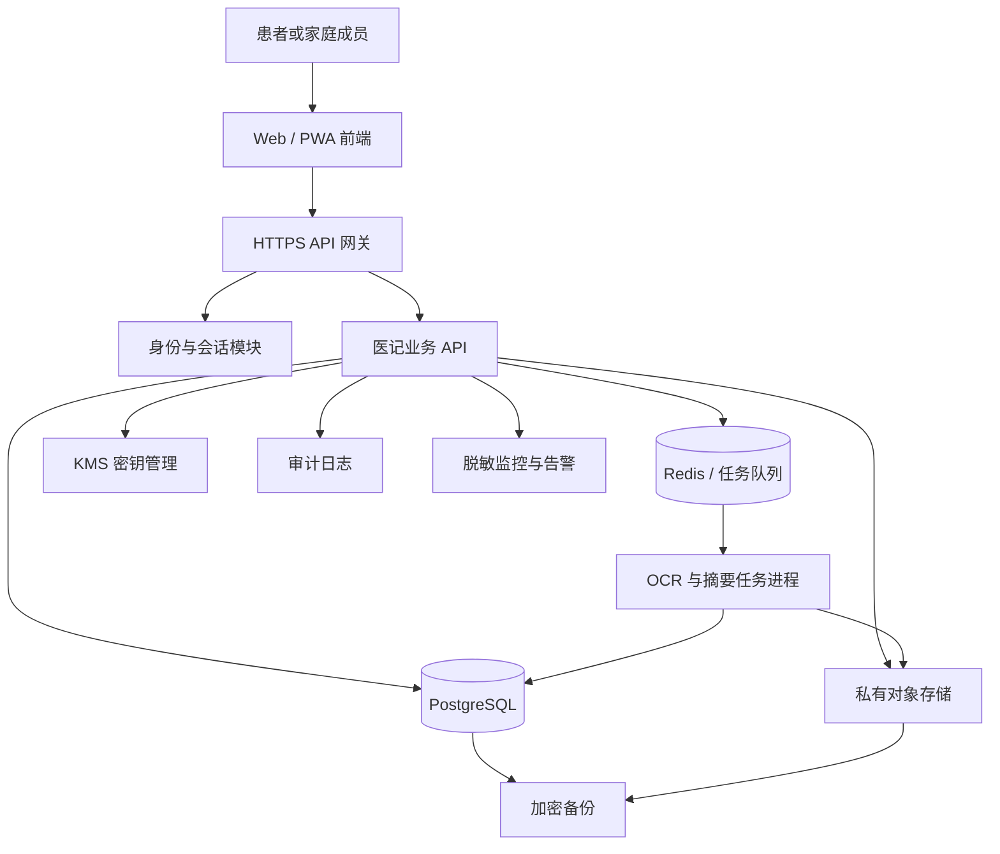
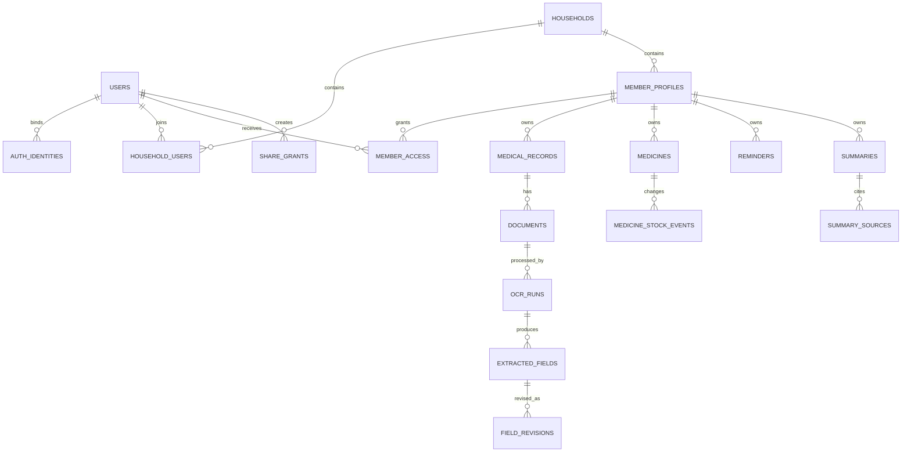

# 医记技术架构与数据权限方案

版本：V1.0  
日期：2026-07-04  
状态：后端开发基线  
产品基线：[PRODUCT_BASELINE.md](./PRODUCT_BASELINE.md)

## 1. 方案结论

第一版采用“模块化单体 + 独立异步任务进程”，不拆微服务。

- 前端：Next.js + TypeScript，移动端优先的响应式网页。
- API：NestJS + TypeScript，统一处理身份、权限和业务规则。
- 数据库：PostgreSQL。
- 缓存与任务队列：Redis + BullMQ。
- 文件：位于中国大陆区域的私有对象存储。
- 密钥：云厂商 KMS；应用代码不保存主密钥。
- OCR：异步任务，供应商必须支持中国大陆处理与明确的数据删除约定。
- 部署：容器化部署在中国大陆云区域；生产、测试环境完全隔离。

本方案优先解决数据隔离和可追溯性。搜索、推荐、复杂数据分析等非核心能力不进入第一阶段。

## 2. 前提与边界

### 2.1 产品前提

- 用户是患者本人或经授权的家庭管理者。
- 产品用于保存、整理、核对、提醒、导出和分享资料。
- 产品不输出诊断结论、疾病概率、治疗方案或自动用药建议。
- 用法用量只能来自用户录入或处方原文。
- 摘要是资料整理结果，必须允许用户核对并追溯到来源。

### 2.2 技术边界

- 首发为中国大陆用户服务，医疗健康数据默认存储在中国大陆。
- 第一版不建设医院系统接口，不接入电子病历平台。
- 第一版不使用医疗资料训练自有或第三方模型。
- 第三方日志、监控、OCR、短信服务不得接收超出其任务所需的医疗信息。
- 后台运营账号默认无权读取病历正文和原文件。

## 3. 总体架构



### 3.1 代码组织

```text
apps/
  web/                 前端应用
  api/                 NestJS API
  worker/              OCR、导出、删除等异步任务
packages/
  contracts/           API 类型与校验规则
  permission/          权限判定规则
  config/              共享配置
infra/
  deploy/              部署清单；后续再引入 IaC
```

`api` 与 `worker` 可以共用业务包，但只有 `api` 接受公网请求。

## 4. 部署拓扑

### 4.1 环境

至少设置三个互相隔离的环境：

| 环境 | 数据要求 | 用途 |
|---|---|---|
| 本地开发 | 仅合成数据 | 开发与单元测试 |
| 测试 | 仅脱敏或合成数据 | 集成、回归和安全测试 |
| 生产 | 真实用户数据 | 正式服务 |

禁止把生产数据库复制到开发者电脑或测试环境。

### 4.2 网络

- API、数据库、Redis、对象存储通过私网连接。
- 数据库和 Redis 不开放公网访问。
- 对象存储桶禁止公共读取。
- 管理操作通过受控运维入口执行并记录审计日志。
- 生产环境开启 Web 应用防火墙、限流和基础 DDoS 防护。

## 5. 身份与会话

### 5.1 登录方式

MVP 支持：

1. 手机号 + 短信验证码。
2. 微信 OAuth 登录。

所有登录方式最终绑定内部不可变的 `user_id`。手机号、微信 OpenID 都只是身份凭证，不能作为业务表主键。

### 5.2 核心表

| 表 | 关键字段 | 用途 |
|---|---|---|
| `users` | `id`, `status`, `created_at` | 内部账号 |
| `auth_identities` | `user_id`, `provider`, `provider_subject` | 手机、微信等登录身份 |
| `sessions` | `user_id`, `token_hash`, `device_id`, `expires_at`, `revoked_at` | 可撤销会话 |
| `login_events` | `user_id`, `result`, `ip_prefix`, `device_id`, `created_at` | 登录安全审计 |

### 5.3 安全规则

- 短信验证码有效期不超过 5 分钟，服务端只保存哈希。
- 对手机号、设备和 IP 分别限流。
- Access Token 短时有效，Refresh Token 每次使用后轮换。
- 换绑手机号、账号冻结或“退出全部设备”后，所有旧会话立即撤销。
- 前端不得把 Token 存入可被任意脚本读取的长期存储；Web 优先使用 `HttpOnly + Secure + SameSite` Cookie。
- 敏感操作需要近期登录或二次验证。

## 6. 家庭成员与权限模型

### 6.1 原则

采用 RBAC 与资源属性结合的方式：角色决定“能做什么”，`member_id` 决定“能对谁的数据做”。

家庭所有者不自动获得成年家庭成员的医疗资料权限。成年成员必须主动接受邀请或明确授权。未成年人档案由监护人管理，并单独记录监护同意。

### 6.2 核心表

| 表 | 关键字段 | 说明 |
|---|---|---|
| `households` | `id`, `owner_user_id`, `plan` | 家庭容器与订阅 |
| `household_users` | `household_id`, `user_id`, `status` | 账号是否属于该家庭 |
| `member_profiles` | `id`, `household_id`, `subject_user_id`, `subject_type` | 本人、成年人、未成年人档案 |
| `member_access` | `member_id`, `user_id`, `role`, `status`, `granted_by`, `expires_at` | 用户对某成员档案的授权 |
| `member_invitations` | `member_id`, `invitee`, `token_hash`, `expires_at`, `accepted_at` | 成年成员邀请与确认 |
| `consent_receipts` | `user_id`, `member_id`, `scope`, `policy_version`, `granted_at`, `withdrawn_at` | 同意凭证 |

### 6.3 档案角色

| 角色 | 适用对象 | 权限说明 |
|---|---|---|
| `SELF` | 档案本人 | 完整控制本人档案 |
| `GUARDIAN` | 未成年人监护人 | 完整管理未成年人档案 |
| `MANAGER` | 获授权家人 | 管理资料、药箱和提醒；不能变更档案本人身份 |
| `CONTRIBUTOR` | 协助录入者 | 上传和修改资料；不能分享、导出或删除整个档案 |
| `VIEWER` | 只读家人 | 查看已授权内容；不能下载原件、分享或修改 |
| `SUPPORT` | 客服 | 默认无医疗资料权限；临时授权必须有工单、时限和审计 |

### 6.4 权限矩阵

| 操作 | SELF | GUARDIAN | MANAGER | CONTRIBUTOR | VIEWER | SUPPORT |
|---|:---:|:---:|:---:|:---:|:---:|:---:|
| 查看结构化资料 | ✓ | ✓ | ✓ | ✓ | ✓ | 默认否 |
| 查看原文件 | ✓ | ✓ | ✓ | ✓ | 配置决定 | 默认否 |
| 上传资料 | ✓ | ✓ | ✓ | ✓ | — | — |
| 修改识别字段 | ✓ | ✓ | ✓ | ✓ | — | — |
| 管理药箱与提醒 | ✓ | ✓ | ✓ | ✓ | — | — |
| 导出档案 | ✓ | ✓ | ✓ | — | — | — |
| 创建分享 | ✓ | ✓ | ✓ | — | — | — |
| 删除单份资料 | ✓ | ✓ | ✓ | — | — | — |
| 删除整个成员档案 | ✓ | ✓ | 配置决定 | — | — | — |
| 管理成员授权 | ✓ | ✓ | 配置决定 | — | — | — |

### 6.5 后端鉴权算法

每个业务请求必须在后端执行以下检查：

1. 校验会话有效。
2. 根据资源 ID 查询资源真实的 `member_id`，不接受前端单独声明的归属。
3. 查询当前用户有效的 `member_access`。
4. 检查角色是否允许当前动作。
5. 检查授权是否过期、撤回或被冻结。
6. 写入允许或拒绝的安全审计事件。
7. 任一步不满足即拒绝，默认权限为无。

禁止先按资源 ID 查询完整数据，再在应用层过滤。数据库查询必须同时带上允许访问的 `member_id` 范围。

### 6.6 必须通过的越权测试

- 用户 A 把资料 ID 替换成用户 B 的 ID，返回 404 或 403，不能泄露标题。
- 用户 A 不能使用用户 B 的文件临时下载地址。
- VIEWER 直接请求导出 API 时必须失败。
- 已撤销的成员授权在所有设备上立即失效。
- 已撤销分享链接不能继续访问缓存内容。
- 后台客服没有工单授权时不能打开原文件。

## 7. 业务数据模型



所有医疗、药品、提醒、摘要资源都必须直接包含 `member_id`，避免跨表推导归属造成权限漏洞。

## 8. 文件上传、加密和访问

### 8.1 上传流程

1. 前端向 API 申请上传。
2. API 完成权限和文件类型检查，创建 `document` 草稿。
3. API 返回短期上传凭证，限定对象路径、大小和 MIME 类型。
4. 前端直接上传到私有对象存储。
5. API 校验文件大小、哈希和实际文件类型。
6. 文件进入隔离状态并完成恶意文件扫描。
7. 扫描通过后进入 OCR 队列。

### 8.2 存储规则

- 对象键采用随机 UUID，不使用姓名、手机号、疾病或机构名。
- 存储桶始终私有，不允许公共 ACL。
- 服务端加密使用 KMS 管理的密钥；密钥至少按环境隔离。
- 原文件生成 SHA-256 哈希并写入数据库。
- 文件下载使用短期签名地址，建议有效期不超过 5 分钟。
- 下载前再次鉴权，签名地址只允许访问单一对象。
- HTTP 响应禁止公共缓存，并设置安全的 `Content-Disposition`。

## 9. OCR 与逐字段追溯

### 9.1 数据表

| 表 | 关键字段 |
|---|---|
| `documents` | `id`, `member_id`, `object_key`, `sha256`, `mime_type`, `status` |
| `document_pages` | `document_id`, `page_no`, `width`, `height` |
| `ocr_runs` | `document_id`, `provider`, `model_version`, `started_at`, `completed_at`, `status` |
| `extracted_fields` | `ocr_run_id`, `page_no`, `field_type`, `raw_text`, `parsed_value`, `bbox`, `confidence` |
| `field_revisions` | `field_id`, `old_value`, `new_value`, `changed_by`, `reason`, `created_at` |

### 9.2 不可变规则

- 原始文件和原始 OCR 输出不可被覆盖；重新识别必须创建新的 `ocr_run`。
- 用户修改只创建 `field_revision`，不能删除原识别值。
- 页面展示的“当前值”由最新有效修订计算得到。
- 摘要引用字段时保存 `field_id` 和版本，不能只复制一段无法追踪的文字。

### 9.3 核对界面要求

- 字段旁显示来源文件、页码和原图位置。
- 低置信度字段突出显示。
- 用户可以查看原文、修改值并填写修改原因。
- 摘要中的每条信息可以跳转回字段或原始资料。
- OCR 供应商返回后，临时文件应按合同约定及时删除。

## 10. 摘要生成

摘要输入由两部分组成：

1. 用户主动选择并已核对的资料字段。
2. 用户填写的近期情况、持续时间和本次目的。

摘要输出必须保存：

- 生成时间和生成方式。
- 使用的模型或规则版本。
- 每个段落对应的 `source_type`：`RECORD` 或 `USER_SUPPLEMENT`。
- 对应的记录、字段或补充信息 ID。
- 用户核对状态和修改历史。

摘要不能自动加入用户未选择的家庭资料，也不能把模型推断写成事实。

## 11. 限时分享

### 11.1 表结构

`share_grants` 至少包含：

- `id`
- `created_by`
- `member_id`
- `token_hash`
- `scope`
- `resource_ids`
- `expires_at`
- `revoked_at`
- `max_views`
- `view_count`
- `created_at`

### 11.2 规则

- 链接令牌使用高强度随机值，数据库只保存哈希。
- 默认有效期 7 天，可选 24 小时或 30 天。
- 分享必须明确列出摘要和原文件范围。
- 撤销后立即拒绝访问并清除相关缓存。
- 分享页禁止搜索引擎收录，禁止公共缓存。
- 每次访问记录时间、结果和必要的安全信息，不记录病历正文。
- 高敏感分享可增加访问口令或短信验证。

## 12. 操作审计

审计事件至少包括：

- 登录、登录失败、换绑和退出全部设备。
- 创建、接受、撤回成员授权。
- 上传、查看、下载、修改和删除资料。
- OCR 识别、字段核对和字段修改。
- 摘要生成、编辑、导出。
- 分享创建、访问、过期和撤销。
- 后台临时授权和访问。

审计字段：

```text
event_id
actor_user_id
actor_type
action
resource_type
resource_id
member_id
result
reason_code
ip_prefix
device_id
request_id
created_at
```

审计日志不保存病历正文、OCR 原文、验证码、完整手机号或文件临时地址。日志采用追加写入，普通业务管理员无修改权限。

## 13. 用户数据权利和删除

### 13.1 隐私中心能力

- 查看数据收集目的和保存期限。
- 查看、下载和更正个人信息。
- 导出结构化数据与原文件。
- 删除单份资料或成员档案。
- 撤回敏感个人信息处理同意。
- 查看并撤销分享。
- 注销账号。
- 查看第三方服务清单和政策版本。

### 13.2 删除流程

1. 对敏感操作进行二次验证。
2. 立即撤销相关会话、分享和后台访问权限。
3. 创建 `deletion_request` 和不可遗漏的删除标记。
4. 异步删除数据库业务数据和对象存储文件。
5. 写入只包含必要证明信息的删除完成记录。
6. 备份按既定周期到期清除；从备份恢复时重新执行所有删除标记。

MVP 内部目标：主存储删除任务 7 日内完成，备份副本在不超过 35 日的轮换周期内清除。最终期限需要在上线前由合规评审确认，并与隐私政策保持一致。

## 14. 同意和隐私记录

敏感健康信息、成年家庭成员授权、第三方分享应分别记录同意，不合并为一个笼统勾选框。

`consent_receipts` 保存：

- 同意人和对应成员。
- 处理目的、数据范围和使用方式。
- 政策版本。
- 展示文本哈希。
- 同意时间、来源设备和撤回时间。

在处理敏感个人信息前完成个人信息保护影响评估；评估内容至少覆盖处理必要性、权益影响、安全风险和保护措施。评估报告和记录按照法律要求保存。

## 15. 备份与恢复

### 15.1 目标

- 数据库开启时间点恢复能力。
- 每日加密备份，并保留可验证的备份清单。
- 文件存储开启版本保护或等效防误删机制。
- 备份位于中国大陆的独立可用区或灾备区域。
- MVP 目标：RPO 不超过 15 分钟，RTO 不超过 4 小时。

### 15.2 恢复演练

- 测试环境每月执行一次自动恢复验证。
- 生产环境至少每季度执行一次恢复演练。
- 演练必须确认数据库、文件、权限关系和删除标记一致。
- 只备份但从未成功恢复，不视为具备恢复能力。

## 16. 错误监控与告警

监控范围：

- API 可用性、延迟和错误率。
- 登录失败、验证码发送和限流异常。
- 403/越权访问异常增长。
- OCR 队列堆积、失败率和低置信度比例。
- 文件上传、下载和病毒扫描失败。
- 数据库、Redis、对象存储和备份状态。
- 分享链接异常访问。

日志发送前统一脱敏：姓名、手机号、病历正文、OCR 文本、Token、Cookie、签名 URL 和请求文件不得进入监控平台。

## 17. 核心 API 草案

```text
POST   /v1/auth/sms/send
POST   /v1/auth/sms/verify
POST   /v1/auth/wechat/callback
POST   /v1/auth/logout
DELETE /v1/auth/sessions

GET    /v1/households/current
POST   /v1/members
POST   /v1/members/:id/invitations
POST   /v1/invitations/:token/accept
GET    /v1/members/:id/access
PATCH  /v1/members/:id/access/:userId

POST   /v1/members/:memberId/documents/upload-intent
POST   /v1/documents/:id/complete-upload
GET    /v1/documents/:id
GET    /v1/documents/:id/download-url
DELETE /v1/documents/:id

GET    /v1/documents/:id/fields
PATCH  /v1/fields/:id
GET    /v1/fields/:id/revisions

POST   /v1/members/:memberId/summaries
GET    /v1/summaries/:id
PATCH  /v1/summaries/:id
POST   /v1/summaries/:id/export

POST   /v1/shares
GET    /v1/shares
DELETE /v1/shares/:id
GET    /public/shares/:token

POST   /v1/data-exports
POST   /v1/deletion-requests
GET    /v1/audit-events
```

所有包含资源 ID 的 API 均执行第 6.5 节的后端鉴权算法。

## 18. 安全基线

- 依赖项和容器镜像持续进行漏洞扫描。
- 对上传文件验证扩展名、MIME 和文件特征，限制大小与页数。
- API 使用参数校验、输出编码、CSRF 防护、CSP 和限流。
- 管理后台使用独立域名、强制多因素认证和最小权限。
- 密钥、数据库凭证和第三方密钥进入 Secret Manager。
- 不在代码仓库、日志或前端包中保存生产密钥。
- 每次发布前运行权限回归测试和依赖漏洞检查。
- 发生或可能发生泄露、篡改、丢失时，按应急预案处置、评估并履行通知义务。

## 19. 合规交付物

上线前至少形成以下可审查材料：

1. 个人信息清单与数据流向图。
2. 隐私政策、用户协议和敏感信息单独同意文本。
3. 成年成员授权与未成年人监护同意流程。
4. 个人信息保护影响评估。
5. 第三方 SDK、OCR、短信、云服务清单及合同约束。
6. 数据保存、导出、删除和注销制度。
7. 数据安全事件应急预案。
8. 权限矩阵、审计制度和员工权限流程。
9. 备份恢复演练记录。
10. 个人信息保护合规审计记录。
11. 网站 ICP 备案；发布 APP 时另行完成 APP 备案。

参考法规与官方资料：

- [中华人民共和国个人信息保护法](https://www.npc.gov.cn/npc/c2/c30834/202108/t20210820_313088.html)
- [网络数据安全管理条例](https://www.cac.gov.cn/2024-09/30/c_1729384452307680.htm)
- [个人信息保护合规审计管理办法](https://www.cac.gov.cn/2025-02/14/c_1741233507681519.htm)
- [工业和信息化部关于 APP 备案工作的解读](https://www.miit.gov.cn/jgsj/xgj/hlwgl/art/2023/art_564bf0759d7e41d5b4aa8ce4996b9e84.html)

法规适用和备案范围应由中国区隐私与医疗产品合规律师在正式上线前确认。本方案是产品和工程设计基线，不替代正式法律意见。

## 20. 后端开发顺序

### 阶段 0：工程骨架

- 建立 monorepo、环境配置和数据库迁移。
- 建立 API 错误格式、请求 ID、结构化脱敏日志。
- 建立最小 CI：类型检查、测试、迁移检查、依赖扫描。

验收：本地可一条命令启动 API、数据库和 Redis；测试环境自动部署。

### 阶段 1：身份、家庭和权限

- 手机验证码模拟接口，随后接入正式短信供应商。
- 用户、会话、家庭、成员、邀请和授权表。
- 统一权限守卫与越权测试。
- 审计事件基础设施。

验收：不同家庭数据完全隔离；撤回授权立即生效；权限测试全部通过。

### 阶段 2：文件和 OCR 追溯

- 私有对象存储、短期上传和下载凭证。
- 文件扫描、哈希、OCR 队列。
- 字段来源、置信度、修订历史。
- 原图定位与核对 API。

验收：上传一份 PDF 后可以核对字段、修改值并返回原页位置；原文件不可被覆盖。

### 阶段 3：核心业务

- 病历分类、时间线和趋势。
- 药箱、库存事件和提醒。
- 摘要来源、用户补充和编辑历史。
- PDF 导出。

验收：现有原型的核心流程接入真实 API，不再依赖写死数据或 localStorage。

### 阶段 4：分享、数据权利和运营安全

- 限时分享、撤销和访问记录。
- 数据导出、删除和注销任务。
- 备份恢复、监控告警和管理后台临时授权。
- 合规材料、安全测试和封闭测试。

验收：完成一次恢复演练、一次数据删除演练、一次越权测试和一次分享撤销测试。

## 21. MVP 完成定义

后端只有同时满足以下条件才可进入封闭测试：

- 所有医疗资源都有 `member_id`，并在后端鉴权。
- 自动化越权测试覆盖读取、修改、下载、导出、分享和删除。
- 原始文件私有存储并通过 KMS 加密。
- OCR 字段能够追溯到文件、页码、区域和修改历史。
- 审计日志覆盖敏感操作且不包含病历正文。
- 分享可过期、可撤销且不会泄露其他成员数据。
- 用户能够导出、删除并注销。
- 备份已成功恢复，不只是显示备份成功。
- 监控日志完成敏感信息脱敏。
- 隐私影响评估和上线合规评审完成。

## 22. 开发前仍需确认的业务决策

以下问题不阻塞工程骨架，但必须在对应模块开发前定稿：

1. 成年家庭成员是否允许 MANAGER 导出和删除其全部档案。
2. VIEWER 是否允许查看原始文件，还是只看结构化摘要。
3. 删除主存储和备份的最终承诺期限。
4. OCR 供应商和数据处理区域。
5. 手机号、微信之外是否需要邮箱登录。
6. 分享是否默认增加访问口令。
7. 个人版、小家庭版、大家庭版的正式容量和配额。

