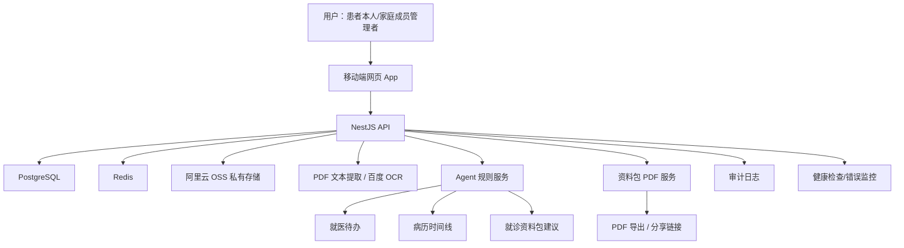

# 医记 Agent 版本技术方案

本文基于已确认的 `SPEC.md` 和当前代码状态制定，仅用于技术设计与开发计划，不包含实现代码。

## 1. 技术栈选择

### 已有技术栈

| 层级 | 当前选择 | 继续使用理由 |
| --- | --- | --- |
| 前端 | 原生 HTML / CSS / JavaScript，移动端优先 | 当前 `app.html` 已可运行，适合快速验证 Agent 流程；短期不引入框架可降低迁移风险 |
| 后端 | NestJS + TypeScript | 已有模块化 API、鉴权、审计、上传、OCR、资料包等基础 |
| 数据库 | PostgreSQL + Prisma | 已有完整用户、成员、病历、识别、待办、资料包、审计模型 |
| 缓存 | Redis | 已用于验证码、会话/健康检查等状态能力 |
| 文件存储 | 阿里云 OSS 私有存储 | 符合中国大陆上线方向；当前已做 OSS 适配，但需要补测试与生产配置验证 |
| OCR | PDF 文本提取 + 百度 OCR | 与 SPEC 确认一致；识别不确定时进入人工核对 |
| PDF | PDFKit | 已有资料包 PDF 导出基础，可继续扩展嵌入原始资料 |
| 部署 | 阿里云 ECS + Nginx + PM2 | 当前测试部署已跑通，后续补 HTTPS、备案、监控和备份 |

### 暂不引入

- 暂不引入聊天框或 Agent 对话框。
- 暂不做原生 iOS 实现，只保持接口和产品结构可迁移。
- 暂不做商业化、支付、订阅。
- 暂不引入大型前端框架，除非后续 `app.html` 维护成本明显失控。

## 2. 当前 SPEC 与现有代码的冲突/缺口

以下内容需要在实现前由用户审核确认。技术计划会按 SPEC 给出建议，但不在本阶段直接实现。

| 编号 | 冲突或缺口 | 当前代码状态 | 按 SPEC 的处理建议 |
| --- | --- | --- | --- |
| C1 | 第一版不做跨账号家庭成员授权 | `FamilyController` 已存在 invitation/access 接口，Prisma 也有相关模型 | 第一版后端禁用邀请/授权接口，UI 不暴露跨账号协作入口 |
| C2 | 第一版需要资料包分享链接 | `VisitPack` 没有分享令牌、有效期、撤回字段；无分享 API | 新增分享模型或字段，提供生成、访问、撤回接口 |
| C3 | 原始资料应嵌入 PDF | 当前 PDF 仅列附件清单，未嵌入原始文件 | 扩展 PDF 生成逻辑；图片可嵌入页面，PDF 原件需转为附件页或说明页 |
| C4 | Agent 主动提醒 | 前端已有部分本地待办推导，后端 `TodoItem` 仍是通用待办 | 新增后端 Agent 规则服务，将待办生成落到服务端 |
| C5 | Agent 输出可追溯 | `RecognitionTask`/`RecognizedField` 已有基础，但资料包/待办未统一记录来源 | 增加 Agent 建议来源结构，关联 recordId、fieldName、sourceText |
| C6 | 正式文件统一 OSS | `RecordFileStorageService` 已支持 OSS，但未做集成测试和生产验证 | 增加 OSS 配置校验、上传/读取/删除测试、部署检查 |
| C7 | 中国大陆上线合规 | 隐私/协议已有页面，备案/HTTPS/监控仍需控制台和运维完成 | 文档和脚本已部分准备，仍需人工完成备案和密钥配置 |
| C8 | 旧功能残留 | 后端仍有 medicines/metrics 模块；SPEC 第一版不以药品/指标为核心 | 本阶段不新增相关能力；后续可做弃用或隐藏 |
| C9 | 邮件服务 | 当前使用 Resend，可能不是最优中国大陆长期方案 | 第一版可保留；正式发布前评估阿里云邮件推送或国内可达方案 |

## 3. 系统架构



核心原则：

- 所有医疗资料先存原件，再做识别。
- OCR/Agent 输出只是候选结果，必须用户核对后归档。
- Agent 不直接给诊断、治疗、用药建议。
- 用户数据按 memberId 隔离。
- 原始文件全部私有存储，不暴露 OSS 公网直链。

## 4. 模块划分

### 前端模块

当前前端仍以 `app.html` 为主。第一阶段可以继续在单文件内实现，若继续变大，再拆为 `app.js` / `style.css`。

| 模块 | 责任 |
| --- | --- |
| 登录模块 | 邮箱验证码、会话保存、退出登录 |
| 成员模块 | 本人档案、家庭成员切换和创建 |
| 上传核对模块 | 多文件上传、OCR 结果展示、字段核对、重新识别 |
| 病历资料模块 | 列表、搜索、筛选、查看原件、编辑字段、删除 |
| 时间线模块 | 由归档资料生成时间线，支持分类过滤和手动记录 |
| Agent 待办模块 | 展示后端生成的资料补全、复诊提醒、资料包提醒 |
| 资料包模块 | 选择目的、范围、资料、近期情况、问题、附件、预览、导出、分享 |
| 个人中心模块 | 账号、成员、隐私、安全、导出、删除入口 |

### 后端模块

| 模块 | 当前状态 | 下一阶段责任 |
| --- | --- | --- |
| auth | 已有邮箱/短信、会话、退出 | 保留邮箱主路径，弱化短信 |
| family | 已有 household/member/access/invitation | 第一版只保留同账号家庭成员入口 |
| records | 已有上传、多文件、OCR、核对、原件、删除、重新识别 | 补字段结构、来源追溯、Agent 触发点 |
| visit-packs | 已有创建、生成、PDF 导出 | 补分享链接、嵌入原始资料、附件控制 |
| todos | 已有通用待办 | 补 Agent 规则生成/刷新就医待办 |
| account | 已有导出、删除申请、清理 | 补正式数据导出边界和删除验收 |
| audit | 已有审计服务 | 扩展 Agent、分享链接、文件读取审计 |
| monitoring | 已有基础日志/webhook | 已确认使用阿里云日志服务；需补服务端日志采集、告警规则和前端错误上报入口 |
| storage | OSS/Vercel/local 三种路径 | 第一版生产统一 OSS，本地仅开发兜底 |

## 5. 数据结构

### 现有核心模型

- `User`：登录用户。
- `Session`：登录会话。
- `Household`：家庭空间。
- `MemberProfile`：本人或家庭成员档案。
- `MemberAccess`：成员访问授权；第一版保留模型但禁用跨账号邀请/授权接口，避免上线暴露未使用权限能力。
- `MedicalRecord`：病历资料。
- `MedicalRecordFile`：原始文件。
- `RecognitionTask`：识别任务。
- `RecognizedField`：识别字段。
- `TodoItem`：待办。
- `VisitPack`：资料包。
- `AuditEvent`：审计事件。

### 建议新增/调整的数据结构

#### VisitPack 分享

建议新增 `VisitPackShare`，不要把分享字段塞进 `VisitPack` 主表，便于撤回、审计和多次生成链接。

字段建议：

```text
id
packId
createdById
tokenHash
expiresAt
revokedAt
accessCount
lastAccessedAt
createdAt
```

分享访问使用随机 token，只存 hash，不存明文 token。

#### Agent 建议

第一版可以先不单独建表，先用 `TodoItem.metadata` 和 `MedicalRecord.extractedFields` 承载：

```json
{
  "agent": {
    "rule": "missing_visit_date",
    "sourceType": "medical_record",
    "sourceId": "record-id",
    "suggestedAction": "review_record"
  }
}
```

如果后续 Agent 建议复杂化，再新增 `AgentSuggestion` 表。

#### PDF 附件策略

`VisitPack.content` 需要增加：

```json
{
  "includeOriginalFiles": true,
  "attachmentMode": "embed_pdf",
  "selectedRecordIds": []
}
```

## 6. 关键接口

### 已有接口

| 方法 | 路径 | 说明 |
| --- | --- | --- |
| POST | `/v1/auth/email/send` | 发送邮箱验证码 |
| POST | `/v1/auth/email/verify` | 邮箱验证码登录 |
| POST | `/v1/auth/logout` | 退出当前会话 |
| DELETE | `/v1/auth/sessions` | 撤销全部会话 |
| GET | `/v1/members` | 获取可访问成员 |
| POST | `/v1/members` | 创建家庭成员 |
| GET | `/v1/records` | 获取病历资料 |
| POST | `/v1/records/upload` | 上传病历资料 |
| POST | `/v1/records` | 手动添加病历资料 |
| PATCH | `/v1/records/:recordId/review` | 核对/编辑资料 |
| DELETE | `/v1/records/:recordId` | 删除资料 |
| POST | `/v1/records/:recordId/recognition/rerun` | 重新识别 |
| GET | `/v1/records/:recordId/files/:fileId/original` | 查看原件 |
| GET | `/v1/todos` | 获取待办 |
| POST | `/v1/todos` | 创建待办 |
| POST | `/v1/todos/:todoId/complete` | 完成待办 |
| GET | `/v1/visit-packs` | 获取资料包 |
| POST | `/v1/visit-packs` | 创建资料包 |
| POST | `/v1/visit-packs/:packId/generate` | 生成资料包内容 |
| GET | `/v1/visit-packs/:packId/export.pdf` | 导出 PDF |

### 建议新增接口

| 方法 | 路径 | 说明 |
| --- | --- | --- |
| POST | `/v1/agent/todos/refresh` | 根据资料状态刷新 Agent 待办 |
| GET | `/v1/records/timeline` | 服务端返回时间线结构 |
| POST | `/v1/visit-packs/:packId/shares` | 创建限时分享链接 |
| DELETE | `/v1/visit-packs/:packId/shares/:shareId` | 撤回分享链接 |
| GET | `/v1/share/visit-packs/:token` | 公开但限时访问资料包页面 |
| GET | `/v1/share/visit-packs/:token/export.pdf` | 分享链接下载 PDF |
| POST | `/v1/storage/health` | 管理员/运维检查 OSS 读写配置 |

## 7. 文件和目录设计

### 当前目录

```text
app.html                         当前网页 App
index.html                       原型展示页
apps/api/src                     后端源码
apps/api/test                    后端测试
prisma/schema.prisma             数据模型
scripts                          部署、OCR、备份、运维脚本
privacy.html                     隐私政策
terms.html                       用户协议
SPEC.md                          产品/开发规格
ALIYUN_PRODUCTION_TODO.md        阿里云上线清单
```

### 建议新增目录/文件

```text
docs/TECHNICAL_DESIGN.md         本技术方案
tasks/plan.md                    开发计划
tasks/todo.md                    可勾选任务清单
apps/api/src/agent               Agent 规则服务
apps/api/src/visit-packs/share   资料包分享服务
apps/api/test/agent.*.test.ts    Agent 待办测试
apps/api/test/visit-pack-share.* 资料包分享测试
```

### 前端拆分建议

短期不强制拆分 `app.html`，避免引入构建复杂度。若继续扩展 Agent UI，建议拆为：

```text
app.html                         页面骨架
style.css                        样式
app.js                           入口和路由
public                           构建输出
```

当前项目已出现 `app.js` 和 `style.css`，但实际构建仍以 `app.html` 为主。是否正式拆分需单独确认。

## 8. Windows 与 Mac 兼容方案

### 开发环境

- Node.js：使用 `package.json` 声明的 `>=24.0.0`。
- 包管理：使用 `npm` 和 `package-lock.json`。
- 路径：代码内统一使用 Node `path` API，不拼接硬编码斜杠。
- 脚本：
  - 跨平台 Node 脚本优先放 `scripts/*.mjs` 或 `scripts/*.ts`。
  - Windows 专用脚本使用 `.ps1`。
  - Linux 服务器脚本使用 `.sh`。

### 打包与上传

已有 `scripts/build-aliyun-package.ps1` 解决 Windows 打包 zip 在 Linux 解压时的路径分隔符问题。后续如支持 Mac，应新增等价 Node 版打包脚本，避免依赖 PowerShell。

建议新增：

```text
scripts/build-aliyun-package.mjs
```

用于 Windows / Mac / Linux 通用打包。

## 9. 路径处理方式

### 原则

- 数据库存储文件路径只存逻辑路径或私有存储路径。
- OSS 文件使用 `oss://bucket/key` 形式存储，不存公网 URL。
- 本地开发文件使用绝对路径或 `LOCAL_RECORD_STORAGE_DIR`。
- API 返回原件读取地址时走后端代理接口，不暴露 OSS 临时签名给前端。

### 当前策略

- 生产：阿里云 OSS。
- Vercel 兼容：Vercel Blob。
- 本地开发：`storage/medical-records` 或 `LOCAL_RECORD_STORAGE_DIR`。

### 风险

历史测试数据可能存在本地路径或 Vercel Blob URL。迁移到 OSS 时需要处理旧文件路径，否则原件读取会不一致。

## 10. 敏感配置和 API Key 管理

### 配置来源

- 本地：`.env` / `.env.local`，不得提交密钥。
- 阿里云服务器：`/root/yiji.env`，部署脚本追加到 `/opt/yiji/.env`。
- Vercel：Vercel Environment Variables。

### 关键配置

```text
DATABASE_URL
REDIS_URL
RESEND_API_KEY
RESEND_FROM_EMAIL
RESEND_WEBHOOK_SECRET
BAIDU_OCR_API_KEY
BAIDU_OCR_SECRET_KEY
BAIDU_OCR_MEDICAL_ENDPOINT
ALIYUN_OSS_REGION
ALIYUN_OSS_BUCKET
ALIYUN_ACCESS_KEY_ID
ALIYUN_ACCESS_KEY_SECRET
HEALTHCHECK_WEBHOOK_URL
```

### 管理原则

- API Key 不进入 `SPEC.md`、计划文档、代码、测试快照。
- 服务端日志不得输出密钥、验证码、病历正文、OCR 原文。
- RAM 用户只授予单个 OSS Bucket 的最小读写权限。
- 生产环境启动时应校验 OSS、数据库、Redis 的必要配置。

## 11. 测试方案

### 单元测试

覆盖：

- Agent 规则生成。
- OCR 结果可靠性判断。
- 资料标题和分类建议。
- 分享 token hash、过期、撤回。
- 权限检查。
- OSS storage adapter 的路径处理和错误处理。

命令：

```bash
npm test
```

### 集成测试

覆盖：

- 上传 → OCR → 核对 → 归档 → 时间线 → 待办。
- 创建资料包 → 生成预览 → 导出 PDF。
- 创建分享链接 → 访问 → 撤回后不可访问。
- OSS 上传/读取/删除。

命令：

```bash
npm run check
```

### 手工验收

移动端浏览器尺寸下验证：

- 邮箱登录。
- 上传多页资料。
- 核对页字段展示。
- 重新识别。
- 时间线分类。
- 待办生成。
- 资料包 PDF。
- 分享链接有效期和撤回。

### OCR 评测

用户提供真实资料和人工标准答案。第一轮建议 30-50 份，记录：

- 上传成功率。
- 可读识别率。
- 关键字段准确率。
- 人工修改率。
- 流程成功率。

## 12. 技术风险

| 风险 | 影响 | 缓解 |
| --- | --- | --- |
| OCR 识别不稳定 | 用户误信错误字段 | 所有字段必须核对；低置信度留空；做测试集评测 |
| Agent 被误认为医疗建议 | 合规风险高 | 文案、系统规则、测试中明确禁止诊断/治疗/用药建议 |
| `app.html` 单文件继续膨胀 | 维护成本上升 | 短期控制变更；后续拆分 `app.js` / `style.css` |
| OSS 配置错误 | 原件上传或读取失败 | 增加 storage health check 和集成测试 |
| 分享链接泄露 | 敏感资料风险 | token hash 存储、有效期、撤回、访问审计 |
| PDF 嵌入原始资料复杂 | 导出失败或文件过大 | 限制附件数量/大小；图片优先嵌入；PDF 原件先转附件页 |
| 中国大陆合规不完整 | 不能正式公开上线 | ICP、隐私政策、删除导出、审计、备案主体按个人推进 |
| Resend 国内可达性 | 邮件登录失败 | 保留替换为阿里云邮件推送的方案 |
| 备份未验证 | 数据损坏后无法恢复 | 每天自动备份，保留 30 天，上线前至少完成一次恢复演练 |

## 13. 备选方案及取舍理由

### 前端框架

- 方案 A：继续原生 HTML/CSS/JS。
  - 优点：改动小，最快交付。
  - 缺点：复杂 Agent 交互会越来越难维护。
- 方案 B：迁移到 React/Vue。
  - 优点：组件化、状态管理更清晰。
  - 缺点：迁移成本高，会推迟 Agent 第一版。

结论：第一版继续原生，后续视复杂度再迁移。

### Agent 实现方式

- 方案 A：规则 Agent。
  - 优点：可控、合规风险低、可测试。
  - 缺点：智能程度有限。
- 方案 B：大模型 Agent。
  - 优点：表达和归纳能力强。
  - 缺点：成本、隐私、合规和稳定性风险高。

结论：第一版使用规则 Agent + OCR/字段整理，必要时局部调用模型，但不做默认聊天 Agent。

### 文件存储

- 方案 A：阿里云 OSS。
  - 优点：中国大陆可用，和 ECS/备案方向一致。
  - 缺点：需要 RAM 权限和 Bucket 配置。
- 方案 B：本地磁盘。
  - 优点：测试简单。
  - 缺点：备份、扩容、安全风险高。
- 方案 C：Vercel Blob。
  - 优点：已接入过。
  - 缺点：不符合中国大陆长期上线目标。

结论：生产统一 OSS，本地磁盘只作开发兜底。

### 错误监控

已确认使用阿里云日志服务。

- 后端：采集 API 错误、OCR 调用失败、OSS 上传/读取失败、PDF 导出失败、邮件发送失败、登录异常。
- 前端：提供统一错误上报接口，不采集病历正文、诊断名称、药品名称、OCR 原文等敏感内容。
- 告警：第一版至少覆盖接口 5xx、OCR 连续失败、OSS 连续失败、磁盘/内存异常、备份失败。
- 取舍：不默认使用 Sentry，原因是中国大陆部署和数据边界更复杂；不使用纯 webhook，原因是检索、聚合和告警能力不足。
